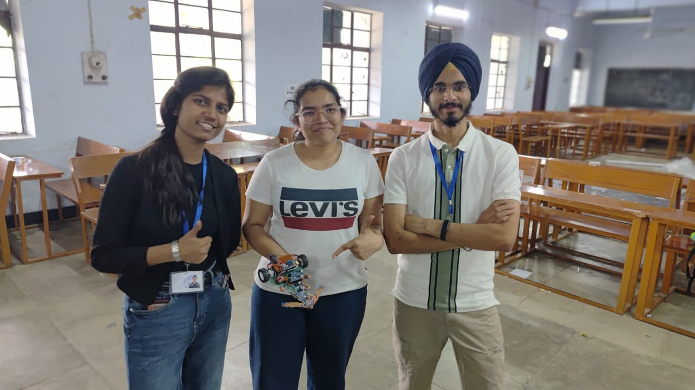
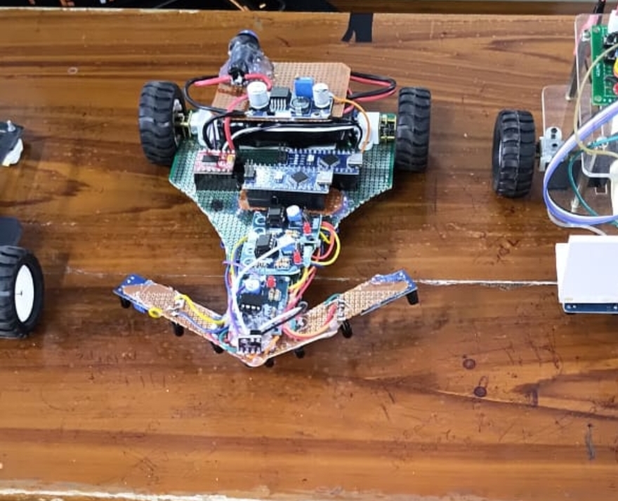

# High-Speed Line Follower Robot V1

A high-speed differential-drive line follower designed for competitive robotics, built around a 7-sensor IR array, PD control, N20 motors, and a dedicated obstacle-stopping system.

The robot was developed and tested for competitive line-following tracks with multiple zones, intersections, curves, thick-line sections, and obstacles.

---

## Competition Result

**1st Runners-Up — Line Follower Robotics Competition, BITS Pilani**

The robot successfully completed all competition zones and demonstrated reliable line tracking along with automatic obstacle detection and stopping.

One of the key features that helped the robot handle the competition track was its dedicated obstacle-stopping system, implemented using a second Arduino Nano rather than adding the entire stopping logic to the main line-following controller.

---

## Team



---

## Demo

### Line Follower in Action

[Watch the Line Follower Demo](media/demo_line.mp4)

---

## Project Overview

The objective of this project was to build a fast and reliable line-following robot capable of handling a competition track rather than simply following a straight line.

The robot combines:

- A 7-element IR sensor array for line detection
- PD-based control for steering
- Differential drive using N20 motors
- TB6612FNG motor driver
- Dual Arduino Nano architecture
- Dedicated obstacle detection and stopping
- 3S Li-ion battery power system
- Buck converter for regulated power
- Custom hand-soldered sensor array
- Mechanical chassis with front-mounted obstacle sensor

The primary challenge was finding a balance between **speed, stability, and reliable track detection**.

---

## Key Features

- High-speed line following
- 7-sensor IR array
- PD steering control
- Differential-drive architecture
- Adjustable proportional and derivative gains
- Thick-line and circle handling
- Lost-line recovery
- Dedicated obstacle detection
- Automatic motor stopping
- Dual-controller architecture
- 3S Li-ion power system
- Compact N20 motor drivetrain

---

## System Architecture

The robot uses two Arduino Nano controllers with separate responsibilities.

```text
                    ┌──────────────────────┐
                    │    7 IR Sensor Array │
                    └──────────┬───────────┘
                               │
                               ▼
                    ┌──────────────────────┐
                    │      Arduino Nano    │
                    │   Main Controller    │
                    └──────────┬───────────┘
                               │
                         PD Controller
                               │
                               ▼
                    ┌──────────────────────┐
                    │     TB6612FNG        │
                    │    Motor Driver      │
                    └───────┬───────┬──────┘
                            │       │
                            ▼       ▼
                         N20       N20
                        Motor     Motor


              Front IR / ToF Sensor
                       │
                       ▼
              ┌──────────────────────┐
              │    Arduino Nano     │
              │ Obstacle Controller │
              └──────────┬───────────┘
                         │
                         ▼
                  Motor Stop Control
```

The main Arduino continuously processes the line sensor readings and calculates the steering correction.

The second Arduino is dedicated to obstacle detection and stopping the robot when an obstacle is detected.

---

## The Robot



---

## Hardware

| Component | Quantity | Purpose |
|---|---:|---|
| Arduino Nano | 2 | Main control + obstacle stopping |
| IR Sensors | 7 | Line detection |
| Front IR / ToF Sensor | 1 | Obstacle detection |
| TB6612FNG | 1 | Dual motor driver |
| N20 Motors | 2 | Differential drive |
| 3S Li-ion Battery Pack | 1 | Main power source |
| Buck Converter | 1 | Voltage regulation |
| Switches | 2 | Power/control |
| Castor Wheel | 1 | Mechanical support |

---

## Electronics

### Main Controller

The primary Arduino Nano handles:

- Reading the 7 IR sensors
- Calculating line position
- Calculating tracking error
- Computing derivative error
- Applying PD correction
- Calculating left and right motor speeds
- Driving the motor driver

### Secondary Controller

The second Arduino Nano is dedicated to the obstacle-stopping mechanism.

Its purpose is to monitor the front obstacle sensor and initiate a motor stop when an obstacle is detected.

This separates the safety/obstacle logic from the high-speed line-following control loop.

---

## 7-Sensor IR Array

The robot uses seven IR sensors positioned across the front of the chassis.

The sensors are represented by the following pins in the main controller:

```cpp
const byte ir[7] = {7,17,4,3,2,16,15};
```

The sensors are assigned different positional weights:

```cpp
int weights[7] = {-8,-6,-2,0,2,6,8};
```

The center sensor has a weight of `0`.

Sensors on the left produce negative values, while sensors on the right produce positive values.

This allows the controller to estimate how far the robot is from the center of the line.

---

## Error Calculation

The line position is calculated using a weighted average.

For every active sensor:

```text
Sensor Position × Sensor Weight
```

is accumulated and divided by the number of active sensors.

Conceptually:

```text
Error = Σ(sensor weight) / Number of active sensors
```

The resulting error represents the position of the line relative to the center of the robot.

### Error Interpretation

```text
Negative Error     → Line is towards the left
Zero Error         → Robot is centered
Positive Error     → Line is towards the right
```

The controller then uses this error to determine how much correction is required.

---

## PD Control

The final control implementation uses **PD control** rather than full PID control.

The controller uses:

- Proportional gain (`Kp`)
- Derivative gain (`Kd`)

The current configuration is:

```cpp
float kp = 40;
float kd = 50;
```

The derivative term is calculated from the change in error:

```cpp
int derivative = error - previous_error;
```

The steering correction is then calculated as:

```cpp
int correction = kp*error + kd*derivative;
```

The correction is limited to prevent excessive motor commands:

```cpp
correction = constrain(correction,-150,150);
```

---

## Motor Speed Control

The robot uses differential drive.

The base speed is:

```cpp
int base_speed = 150;
```

The correction is applied in opposite directions to the two motors:

```cpp
int rightmotorspeed = base_speed + correction;
int leftmotorspeed = base_speed - correction;
```

This produces steering without requiring a mechanical steering mechanism.

### Example

If the robot detects that the line has moved towards the right:

```text
Right correction increases
Left correction decreases
```

The difference in motor speeds causes the robot to turn towards the line.

---

## Motor Pin Configuration

The main Arduino uses the following motor control pins:

```cpp
const byte leftmotor1 = 8;
const byte leftmotor2 = 9;

const byte rightmotor1 = 12;
const byte rightmotor2 = 13;

const byte leftspeedpin = 5;
const byte rightspeedpin = 6;
```

The motors are controlled using the TB6612FNG dual motor driver.

---

## Motor Driver

The robot uses a **TB6612FNG** dual motor driver.

The driver controls both N20 motors independently, allowing differential steering.

Advantages of the TB6612FNG for this application include:

- Two-channel motor control
- PWM speed control
- Compact size
- Efficient motor driving
- Suitable for small N20 motors

---

## Thick-Line and Circle Handling

Competition tracks can contain sections where multiple sensors detect the line simultaneously.

A special condition is used to identify certain wide-line or circular sections:

```cpp
bool onCircle = (
    (digitalRead(ir[2]) == digitalRead(ir[4])) &&
    (digitalRead(ir[3]) != digitalRead(ir[4]))
);
```

When this condition is detected, the controller changes the range of sensors considered for calculating the error.

Instead of using the complete sensor array:

```text
Sensors 0 → 6
```

it uses:

```text
Sensors 1 → 5
```

This reduces the influence of the outer sensors during wide-line sections.

---

## Lost-Line Recovery

A line follower can temporarily lose the line during:

- Sharp turns
- High-speed motion
- Track transitions
- Sensor noise
- Sudden changes in line position

When no valid sensor information is detected, the robot uses the previous error to determine which direction the line was last seen.

The implementation is:

```cpp
if (count == 0)
{
    if (previous_error > 0) return 8;
    else return -8;
}
```

This allows the robot to continue searching in the direction where the line was last detected instead of stopping immediately.

---

## Inverted Track Detection

The controller also monitors the two outer sensors:

```cpp
if (digitalRead(ir[0]) == LOW && digitalRead(ir[6]) == LOW) {
    invertedCounter++;
} else {
    invertedCounter = 0;
}
```

After several consecutive detections:

```cpp
if (invertedCounter > 3) {
    inverted = true;
} else {
    inverted = false;
}
```

This provides a mechanism for recognizing track sections where the sensor pattern changes significantly.

---

## Obstacle Detection and Automatic Stop

A major feature of the robot is its dedicated obstacle-stopping system.

Instead of relying entirely on the main line-following controller, a second Arduino Nano is used for obstacle detection.

A front-mounted IR / ToF sensor monitors the area ahead of the robot.

When an obstacle is detected, the secondary controller triggers the stopping mechanism through the motor-control system.

### Why This Was Important

The competition track required the robot to handle obstacles in addition to following the line.

A robot that could track the line accurately but could not reliably stop would not be able to complete the complete track requirements.

The dedicated obstacle controller allowed the stopping logic to remain independent of the high-speed line-following loop.

---

## Power System

The robot is powered using a:

**3S Li-ion battery pack**

The battery provides the main power source for the robot.

A buck converter is used to regulate the required voltage for the electronics.

### Power Architecture

```text
3S Li-ion Battery
        │
        ├──────────────► Motor Driver
        │
        ▼
   Buck Converter
        │
        ▼
   Control Electronics
```

Switches are used to control the power system.

---

## Mechanical Design

The robot uses a compact differential-drive configuration consisting of:

- Two N20 motors
- Two driven wheels
- Front-mounted sensor array
- Front obstacle sensor
- Rear castor wheel
- Compact electronics arrangement

The sensor array is positioned at the front of the robot to provide enough preview of the line for high-speed correction.

The electronics and battery were arranged to keep the robot compact while maintaining stable movement.

---

## Sensor Array Construction

The 7-sensor array was manually assembled and soldered.

The objective was to maintain:

- Consistent sensor spacing
- Rigid mounting
- Reliable wiring
- Stable sensor orientation
- Minimal movement during high-speed operation

Building the sensor array manually also allowed the spacing and physical layout to be adapted to the robot chassis.

---

## PD Tuning

The most important part of achieving reliable high-speed performance was tuning the controller.

The primary parameters were:

```cpp
int base_speed = 150;

float kp = 40;
float kd = 50;
```

### Proportional Gain

The proportional term determines how strongly the robot responds to the current error.

Increasing `Kp` generally produces a stronger response to the line position.

However, excessive proportional gain can cause:

- Oscillation
- Aggressive steering
- Instability at high speed

### Derivative Gain

The derivative term responds to how quickly the error is changing.

Increasing `Kd` can help reduce oscillations and improve stability during rapid changes in line position.

Too much derivative action can make the robot overly sensitive to sensor noise.

### Tuning Process

The controller was tuned through repeated physical testing rather than relying only on theoretical values.

The process involved:

1. Testing at lower speed
2. Adjusting `Kp`
3. Adjusting `Kd`
4. Increasing base speed
5. Testing sharp turns
6. Testing wide-line sections
7. Testing complete track zones
8. Repeating the process until the robot could maintain stable tracking at competition speed

---

## Competition Challenges

The robot had to deal with more than simply detecting a black line.

The development process involved handling:

- High-speed steering
- Sharp turns
- Sensor noise
- Wide-line sections
- Temporary line loss
- Track transitions
- Obstacle detection
- Reliable stopping
- Battery and power management
- Mechanical stability

The main engineering challenge was balancing **speed with control stability**.

A controller that works perfectly at low speed can behave very differently when the robot is moving significantly faster.

---

## Development Process

The robot was developed through an iterative hardware and software process.

### 1. Sensor Testing

Each IR sensor was tested individually before integrating the complete array.

### 2. Motor Testing

The N20 motors and TB6612FNG driver were tested independently to verify:

- Direction
- PWM control
- Differential movement
- Motor response

### 3. Sensor Array Integration

The seven sensors were assembled into a single front-facing array.

### 4. Basic Line Following

A simple line-following algorithm was implemented before introducing PD control.

### 5. PD Controller

Proportional and derivative control was added to improve stability and response.

### 6. High-Speed Testing

The base speed was progressively increased while tuning the controller.

### 7. Track-Specific Handling

Special handling was added for wide lines, circles, and temporary line loss.

### 8. Obstacle System

A second Arduino Nano and front obstacle sensor were integrated to provide dedicated stopping functionality.

### 9. Competition Testing

The complete robot was tested across the competition track to verify that the individual subsystems worked together reliably.

---

## Competition Performance

The final robot successfully completed all the competition zones and achieved:

**1st Runners-Up at BITS Pilani**

The combination of high-speed PD line following and dedicated obstacle stopping allowed the robot to handle the full track requirements.

The obstacle-stopping system was particularly useful during the competition because it allowed the robot to detect an obstacle and stop independently of the primary line-following algorithm.

---

## Repository Structure

```text
High-Speed-Line-Follower/
│
├── README.md
│
├── Code/
│   ├── line_follower.ino
│   └── obstacle_stop.ino
│
├── media/
│   ├── line_follower.mp4
│   ├── robot_front.jpg
│   ├── robot_side.jpg
│   ├── team_photo.jpg
│   └── robot_track.jpg
│
└── docs/
    └── circuit_diagram.png
```

## Future Improvements

Possible improvements for a future version include:

- Encoder-based speed feedback
- Closed-loop motor speed control
- Dynamic speed adjustment based on curvature
- More advanced track classification
- Better obstacle distance measurement
- Improved sensor filtering
- Custom PCB for the sensor array
- Integrated controller board
- Lightweight custom chassis
- Data logging for controller tuning
- Automated parameter tuning

---

## Author

**Devanshi Maleri**

Engineering student focused on robotics, embedded systems, electronics, and autonomous robotic systems.

---

## Acknowledgements

This project was developed as part of hands-on robotics and competitive engineering work.

Special thanks to the teammates, mentors, and everyone involved in the design, fabrication, testing, debugging, and competition preparation.

---

## License

This project is intended primarily for educational and portfolio purposes.

If you use or modify this work, please provide appropriate attribution.
